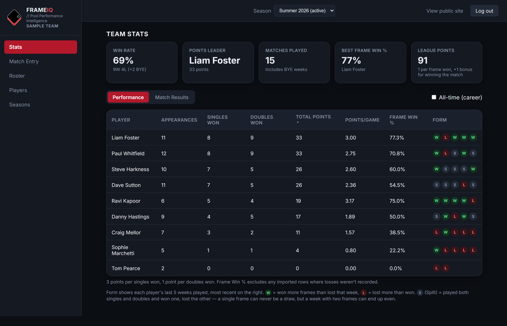
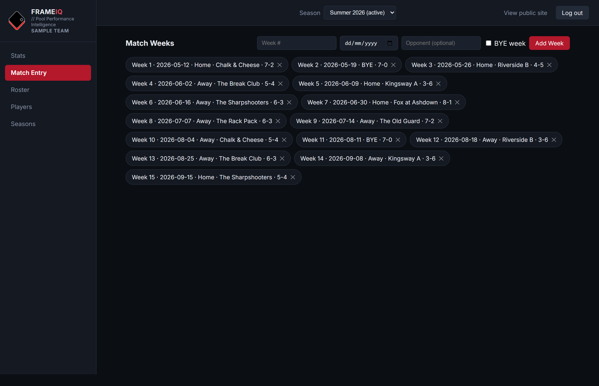
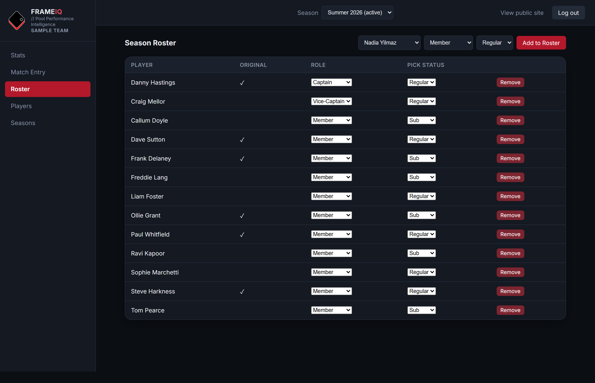
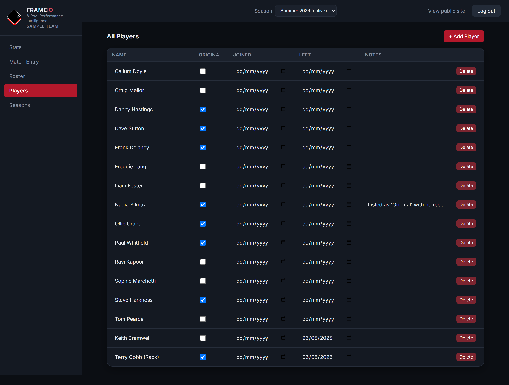
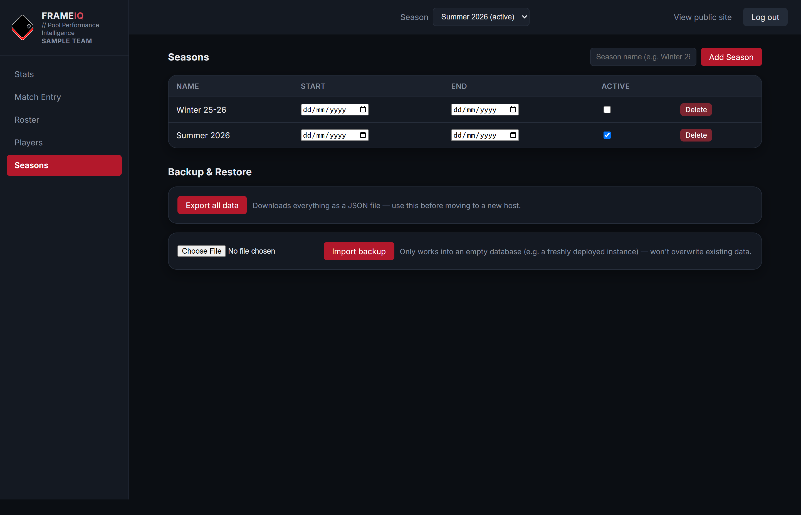
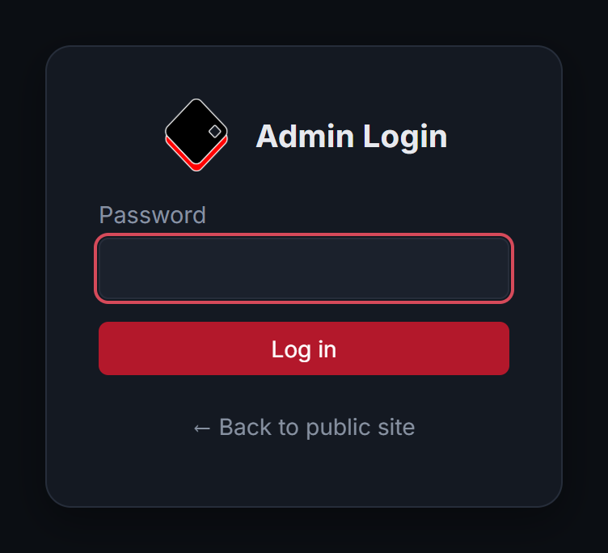

# FrameIQ

A small self-hosted web app for tracking a pool/snooker team's players, weekly match results, and stats — a public results page for anyone to view, plus an admin area for managing everything. Ships pre-loaded with demo data (fictional players/results) so you can see it working before entering your own.

## Admin screenshots

The public results page is what you'd share with your league — everything below is the admin side you manage it from, gated behind your own password.

**Team Stats overview** — live win rate, points leader, league points, and a full performance table with per-player form.


**Match Entry** — log each week's date, venue, opponent, score and BYE weeks in a couple of clicks.


**Roster** — set who's playing each season, their role (Captain/Vice-Captain/Member) and pick status (Regular/Sub).


**Players** — the permanent player list: original-member flag, joined/left dates, notes.


**Seasons & backup** — manage seasons and export/import the full dataset as JSON.


Admin access sits behind a password screen:


## Making it your team's

1. Log in to `/admin` and open **Settings → Branding** to set your team name, upload your logo (PNG, JPEG, WebP or GIF, up to 1 MB — any shape works) and pick an accent color. Click **Save Settings**; it applies everywhere immediately, no code edits or restart needed.
2. Optionally replace `public/favicon-32.png`, `favicon-192.png`, `favicon-512.png`, and `apple-touch-icon.png` with your own icon (browser-tab icons aren't part of Settings yet).
3. Once you're ready to start tracking your own season, delete `data/pool.db` (if it exists) and either run `npm run seed` again after editing `import/seed_data.json` with your own players/results, or just add everything through the admin UI from scratch (Players → Seasons → Roster → Match Entry).

## Running it

```
npm install
cp .env.example .env
```

Then edit `.env` and set your own `ADMIN_PASSWORD` (`SESSION_SECRET` is optional — see below). Then:

```
npm start
```

Open http://localhost:4173 in your browser. Leave the terminal window open while you use the app — closing it stops the server. Data lives in `data/pool.db` (a SQLite file) and persists between runs.

## Public site vs admin

- **`/`** — public, no login required. Pick a season, then switch between Performance (per-player stats and recent form), Match Results, Head-to-Head (all-time record against each opponent) and Awards. Click a player's name for their profile: career totals, season-by-season stats, match history and badges. A sun/moon button switches between light and dark themes (remembered per visitor). This is what you'd share with players.
- **`/admin`** — everything else (Match Entry, Roster, Players, Seasons management, Settings), gated behind the password in `.env`. Log in at `/admin/login`.

If you put this online, make sure `.env` is never committed or exposed — `.gitignore` already excludes it. Sessions are stored in the database, so admin logins survive restarts and redeploys. Login is rate-limited (5 wrong passwords per IP locks it out for 15 minutes), cookies are HttpOnly + SameSite=Lax (Secure over HTTPS), cross-origin writes are rejected, and pages are served with a Content-Security-Policy and other security headers. `SESSION_SECRET` is optional — if unset, a random one is generated and kept in the database.

## Awards, milestones and badges

The public **Awards** tab and each player's profile page are worked out from the results you already enter — there is nothing extra to record.

- **Season awards** — Player of the Season, Sharpshooter (best frame win %), Singles Specialist, Doubles Ace, Most Improved (points per game against the previous season) and Hot Streak (longest run of winning weeks). Ties are shared.
- **Feats** — Iron Man (played every match of the season) and Perfect Season (finished without losing a frame). Anyone who qualifies gets one.
- **Team awards** — Unbeaten Season, Longest Winning Run, Whitewash (a match won without conceding a frame) and Record Season (beat every earlier season on win rate or league points).
- **Career milestones** — First Blood, Half Century, Century Club and Double Century (1st, 50th, 100th and 200th career win), Regular, Veteran and Club Legend (25th, 50th and 100th appearance), plus team milestones for 50 and 100 match wins and 100 matches played. These show as soon as they happen, along with a "Coming up" list of who is close to the next one.
- **Profile badges** — every award and milestone a player has earned appears as a badge on their profile. Winning the same award again adds a count (×2, ×3…).

Season awards, feats and team awards stay hidden until you reveal them: at the end of a season, open **Admin → Seasons** and click **Publish awards**. That freezes the announced result; **Recalculate** re-runs it if a result is corrected later and **Unpublish** hides it again. Publishing is only possible once the season is no longer active. Until then only you see a preview, under **Admin → Stats → Awards**; the public Awards tab just says they are coming. Career milestones need no publishing.

Awards are defined in `src/achievements.js` as plain objects, so thresholds can be tuned, awards switched off or new ones added without touching the rest of the app.

## How the data model works

- **Players** are permanent records: name, original-member flag, joined/left dates, notes. A player exists once regardless of how many seasons they play.
- **Seasons** (e.g. "Summer 2026") each have their own **roster** — who's playing that season, their role (Captain / Vice-Captain / Member) and pick status (Regular / Sub). This can change season to season even though the player record itself doesn't.
- **Match Weeks** belong to a season. Each week has **entries** per player: singles/doubles won and lost, plus optional match details (opponent, date, home/away, score for/against, and a BYE flag for a scheduled bye week) — these are just for your own record-keeping and never factor into the Stats page.
- **Awards** are derived the same way. Only the moment a season's awards are published is stored (a frozen copy, so an announced result can't change by accident).
- **Stats** (Appearances, Points, Win %, League Points, recent Form) are calculated live from match entries — nothing is stored twice, so they're always in sync with the data you enter.

Points = (singles won × points-per-singles-win) + (doubles won × points-per-doubles-win). League Points = (frames won × points-per-frame-won) + a bonus for winning the match — a BYE week still earns frame points for its recorded score, but never the win bonus. All four rates default to 3 / 1 / 1 / 1 and can be changed from **Settings** in the admin area if your league scores differently, with no code change needed.

## Demo data

`import/seed_data.json` ships with two example seasons of realistic-looking (but entirely fictional) match data, used to populate the database the first time you run `npm run seed`. Feel free to edit this file before seeding, or just clear it out and build your own season up through the admin UI instead.

## Putting it online

This app is ready to deploy as-is (it's just a small Node/Express server), but a few things are worth knowing before you do:

- Whatever host you pick needs to run a persistent Node process (Render, Railway, Fly.io, a VPS, etc.) — not a static site host, since this has a real backend and database file.
- Set `ADMIN_PASSWORD` and `SESSION_SECRET` as environment variables on the host (the same names as in `.env`) rather than uploading your `.env` file.
- `data/pool.db` needs to live on persistent storage on whatever host you choose — some platforms wipe the filesystem on every deploy, which would lose your data. Check your host supports a persistent disk/volume, and point `DATA_DIR` at it.
- The app works fine over plain HTTP for local use; once it's on a public domain, put it behind HTTPS (most hosts do this for you automatically).

## Licence

Copyright (c) 2026 Vosnet. Released under the [GNU Affero General Public License v3.0](LICENSE) (AGPL-3.0). You are free to use, modify and self-host FrameIQ. If you run a modified version as a service for others, you must make your modified source available to its users.
